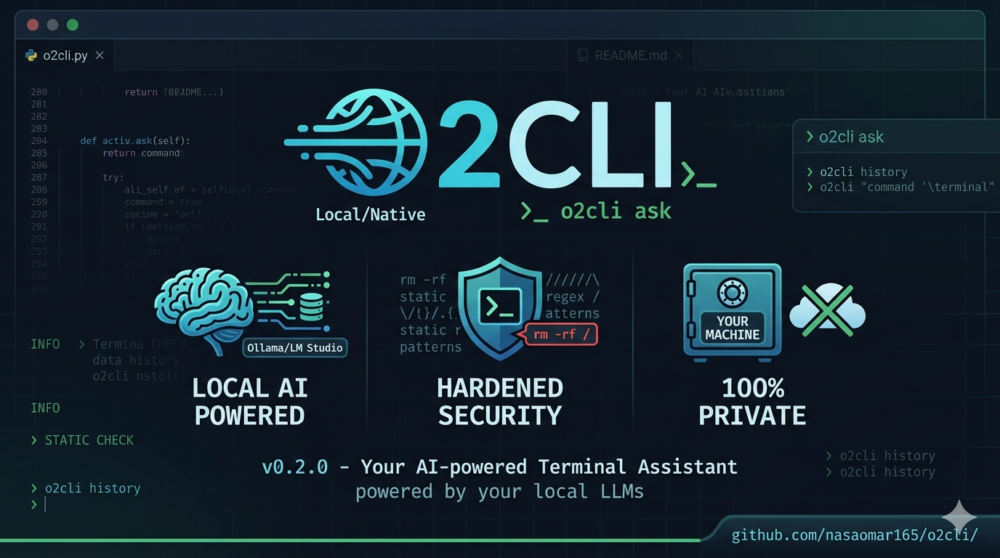

# O2Cli

**O2Cli (v0.2.0)** is an AI-powered CLI tool that converts natural language to terminal commands. It operates entirely locally using LLMs via **Ollama** or **LM Studio**, ensuring your data never leaves your machine. No cloud APIs or internet connection required!




## 🚀 Features

- **Natural Language to Command**: Convert everyday English into precise shell commands (`o2cli ask`).
- **100% Local Privacy**: Powered by local LLMs via Ollama or LM Studio.
- **Interactive Chat**: A dedicated chat interface with handy slash commands (`/ask`, `/chat`).
- **Hardened Security**:
  - Built-in static danger checks (automatically blocks destructive commands like `rm -rf /`).
  - Optional AI safety audits (`--llm-safety`).
  - Execution confirmation prompts before running anything.
  - Configurable trusted directories and allowlists.
- **Context Aware**: Automatically detects project context (e.g., `.git`, `.env`, `package.json`, `Dockerfile`) to generate accurate, context-aware commands.
- **Alias System**: Save recurring prompts as aliases with support for `{template}` variables.
- **Command History**: Track, search, star, and re-run previously generated commands.

## 🛠️ Installation

O2Cli is a single Python script. It automatically installs its required dependencies (`httpx`, `click`, `rich`, `pydantic`, `pyperclip`) on the first run.

1. Download the script:
Created README.md

```bash
   curl -O https://github.com/nasaomar165/o2cli/o2cli.py
   chmod +x o2cli.py
```
2.Move it to your PATH (optional):
```bash
  sudo mv o2cli.py /usr/local/bin/o2cli
```
3.Run it to install dependencies:
```bash
  o2cli --version
```

## ⚙️ Getting Started
Before using O2Cli, ensure you have either Ollama or LM Studio running locally.

Run the configuration wizard to set up your provider, model, and preferred shell:
```bash
  o2cli config --wizard
```
You can check your connection to the LLM backend at any time:
```bash
  o2cli check
```
##📖 Usage
Ask for a Command
Convert natural language to a terminal command. By default, it explains the command and asks for confirmation before executing.
```bash
  o2cli ask "find all python files modified in the last 7 days"
  o2cli ask "undo my last git commit"
```
Helpful flags:

`-e`, `--exec`: Execute immediately without prompting.
`-c`, `--copy`: Copy the generated command to your clipboard.
`--explain-only`: Show the command and explanation, but do not execute.
`-d`, -`-dry-run`: Show the command only.

## Interactive Chat
Start an interactive chat session with your local LLM.
```bash
o2cli chat
```
Inside the chat, you can use:
`/ask <task>`: Generates a command for the task.

`/run <command>`: Executes a specific command and feeds the output back to the AI.

`/clear`: Clears the conversation history.

##Manage Aliases
Save complex or frequently used prompts. Aliases support template variables like `{branch}`.
```bash
  # Create an alias
  o2cli alias set update "update system packages and clean up"
  o2cli alias set push_branch "push current git branch to origin/{branch}"

  # Run an alias
  o2cli alias run update
```

Command History
View and manage your command history.
```bash
  o2cli history             # View recent history
  o2cli history --stats     # View usage statistics
  o2cli history -r 3        # Re-run command #3 from history
  o2cli history -y 5        # Copy command #5 to clipboard
```

## 🛡️ Security
O2Cli prioritizes your system's safety:

- **No Cloud**: Your prompts and system context never leave your machine.
- **Danger Checks**: Static regex analysis intercepts over 30 dangerous patterns (e.g., fork bombs, raw disk writes, history clearing).
- **Safe Execution**: Uses  `subprocess.Popen` without `shell=True` (except where native powershell execution requires it) to prevent shell injection.

## 🩺 Troubleshooting
Run the built-in diagnostic tool to check for missing dependencies, file permissions, and backend connectivity:
```bash
o2cli doctor
```
## 🤝 Contributing
 
1. Fork the repository
2. Make changes to `o2cli.py`
3. Open a pull request
**download and run** — `httpx` , `click` , `rich` , `pydantic` , `pyperclip` only, no `pip install`.

## ⚠️ Disclaimer
The use of `O2cli` is entirely at your own risk.

- This tool uses artificial intelligence to generate shell commands automatically. 
- While it includes safety checks to prevent destructive operations, it does not guarantee the accuracy, safety, or appropriateness of any generated command.
- You are solely responsible for reviewing and understanding every command before executing it.
- The author(s) of this project accept no liability for data loss, system damage, security breaches, or any unintended consequences resulting from the use of this software.

- This software is provided "AS IS" without warranty of any kind. Use at your own risk.
  - No Affiliation: This project is NOT affiliated with NASA or any government organization.
  - No Liability: The authors are not responsible for any damages from using this software.
  - Educational Use: Intended for educational and personal use only.
  - Legal Compliance: Users are responsible for ensuring compliance with applicable laws.
    
 See [DISCLAIMER.md](DISCLAIMER.md) for full details.
